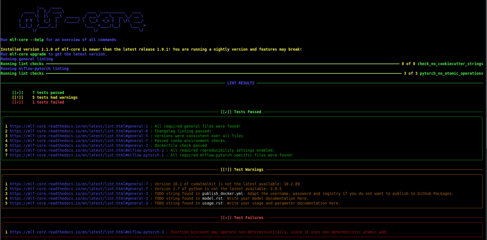

.. _lint:

=====================
Linting your project
=====================

`Linting <https://en.wikipedia.org/wiki/Lint_(software)>`_ is the process of statically analyzing code to find code style violations and to detect errors.
mlf-core implements a custom linting system, but depending on the template external tools linting tools may additionally be called.

mlf-core linting
-----------------------

mlf-core lint can be invoked on an existing project using

.. code-block:: console

    $ mlf-core lint <OPTIONS> <PATH>

mlf-core's linting is divided into three distinct phases.

1. All linting functions, which all templates share are called and the results are collected.
2. Template specific linting functions are invoked and the results are appended to the results of phase 1
3. Template specific external linters are called (e.g. autopep8 for Python based projects)

The linting results of the first two phases are assigned into 3 groups:

.. raw:: html

    
    
    

.. role:: green
.. role:: yellow
.. role:: red

1. :green:`Passed`
2. :yellow:`Passed with warning`
3. :red:`Failed`

If any of the checks failed linting stops and returns an error code.

   Linting applied to a newly created cli-java project.

To examine the reason for a failed linting test please follow the URL. All reasons are explained in the section :ref:`linting_codes`.

.. _linting_codes:

Linting codes
-----------------

The following error or warning numbers correspond to errors found during linting.
If you are not sure why a specific linting error has occurred you may find more information using the respective error code.

General
^^^^^^^^^

general-1
~~~~~~~~~~

| File not found. This error occurs when your project does not include all of mlf-core's files, which all templates share.
| Please create the file and populate it with appropriate values. You should also critically reflect why it is missing, since
  at the time of the project creation using mlf-core this file should not have been missing!

general-2
~~~~~~~~~

| Dockerfile invalid. This error usually originates from empty Dockerfiles or missing FROM statements.

general-3
~~~~~~~~~

| TODO String found. The origin of this warning are ``mlf-core TODO:`` ``TODO mlf-core:`` or strings in the respective files. Usually, they point to things that should be
  manually configured or require other attention. You may remove them if there is no task for you to be solved.

general-4
~~~~~~~~~

| Cookiecutter string found. This error occurs if something went wrong at the project creation stage. After a project has been created using mlf-core
  there should not be any jinja2 syntax left.

general-5
~~~~~~~~~~

| Versions not consistent. If the version of all files specified in the [bumpversion] sections defined in the qube.cfg file are not consistent,
  this error may be found. Please ensure that the version is consistent! If you need to exclude specific lines from this check please consult :ref:`bump-version`.
  To prevent this error you should only increase the version of your project using :code:`mlf-core bump-version`.

general-6
~~~~~~~~~~~~~

| ``changelog.rst`` invalid. The ``changelog.rst`` file requires that every changelog section has a header with the version and the corresponding release date.
  The version above another changelog section should always be *greater* than the section below (e.g. 1.1.0 above 1.0.0).
  Every section must have the headings ``**Added**``, ``**Fixed**``, ``**Dependencies**`` and ``**Deprecated**``.

mlflow-pytorch
^^^^^^^^^^^^^^^^

mlflow-pytorch-1
~~~~~~~~~~~~~~~~~~

| File not found. This error occurs when your project does not include all of mlflow-pytorch's expected files.
| Please create the file and populate it with appropriate values. You should also critically reflect why it is missing, since
  at the time of the project creation using mlf-core this file should not have been missing!

mlflow-pytorch-2
~~~~~~~~~~~~~~~~~~

| Expected line not found. This error occurs when CPU/GPU deterministic training may no longer be guaranteed, since a required setting has been disabled or removed.
| Currently, mlflow-pytorch expects:

.. code-block::
    :linenos:

    def set_pytorch_random_seeds(seed, use_cuda):
    torch.manual_seed(seed)
    if use_cuda:
        torch.cuda.manual_seed(seed)
        torch.cuda.manual_seed_all(seed)  # For multiGPU
        torch.backends.cudnn.deterministic = True
        torch.backends.cudnn.benchmark = False

| Line 2 fixes the seed of Pytorch.
| Given that CUDA support is enabled:
| Line 4 fixes the Pytorch CUDA seed.
| Line 5 fixes the Pytorch CUDA seed for all CUDA devices.
| Line 6 enables deterministic cuDNN operations
| Line 7 disables the search for the optimal algorithm for specific operations, which may not necessarily be deterministic.

mlflow-tensorflow
^^^^^^^^^^^^^^^^^^^^^

mlflow-tensorflow-1
~~~~~~~~~~~~~~~~~~~~~~~

| File not found. This error occurs when your project does not include all of mlflow-tensorflow's expected files.
| Please create the file and populate it with appropriate values. You should also critically reflect why it is missing, since
  at the time of the project creation using mlf-core this file should not have been missing!

mlflow-tensorflow-2
~~~~~~~~~~~~~~~~~~~~~~~~~

| Expected line not found. This error occurs when CPU/GPU deterministic training may no longer be guaranteed, since a required setting has been disabled or removed.
| Currently, mlflow-tensorflow expects:

.. code-block::
    :linenos:

    def set_tensorflow_random_seeds(seed):
        tf.random.set_seed(seed)
        tf.config.threading.set_intra_op_parallelism_threads = 1  # CPU only
        tf.config.threading.set_inter_op_parallelism_threads = 1  # CPU only
        os.environ['TF_DETERMINISTIC_OPS'] = '1'

| Line 2 fixes the seed of Tensorflow
| Line 3 sets the number of threads within an individual operation for parallelism to 1
| Line 4 sets the number of threads between independent operations for parallelism to 1
| Line 5 enables and forces all deterministic operations

mlflow-xgboost
^^^^^^^^^^^^^^^^^

mlflow-xgboost-1
~~~~~~~~~~~~~~~~~~~~~~

| File not found. This error occurs when your project does not include all of mlflow-dask's expected files.
| Please create the file and populate it with appropriate values. You should also critically reflect why it is missing, since
  at the time of the project creation using mlf-core this file should not have been missing!

mlflow-xgboost-2
~~~~~~~~~~~~~~~~~~

| Expected line not found. This error occurs when CPU/GPU deterministic training may no longer be guaranteed, since a required setting has been disabled or removed.
| Currently, mlflow-xgboost expects:

.. code-block::
    :linenos:

    def set_xgboost_random_seeds(seed, param):
        param['seed'] = seed

| Line 2 fixes the seed of XGBoost

mlflow-xgboost-3
~~~~~~~~~~~~~~~~~~

| The version of XGBoost has to be at least 1.1.0, since this is first version which includes all deterministic operations.
| Refrain from using versions older than 1.1.0, especially when making use of GPUs.

mlflow-xgboost_dask
^^^^^^^^^^^^^^^^^^^^^^^^^^

mlflow-xgboost_dask-1
~~~~~~~~~~~~~~~~~~~~~~~~~~~

| File not found. This error occurs when your project does not include all of mlflow-xgboost_dask's expected files.
| Please create the file and populate it with appropriate values. You should also critically reflect why it is missing, since
  at the time of the project creation using mlf-core this file should not have been missing!

mlflow-xgboost_dask-2
~~~~~~~~~~~~~~~~~~~~~~~~~

| Expected line not found. This error occurs when CPU/GPU deterministic training may no longer be guaranteed, since a required setting has been disabled or removed.
| Currently, mlflow-xgboost_dask expects:

.. code-block::
    :linenos:

    def set_xgboost_random_seeds(seed, param):
        param['seed'] = seed

| Line 2 fixes the seed of XGBoost

mlflow-xgboost_dask-3
~~~~~~~~~~~~~~~~~~~~~~~~

| The version of XGBoost has to be at least 1.1.0, since this is first version which includes all deterministic operations.
| Refrain from using versions older than 1.1.0, especially when making use of GPUs.
