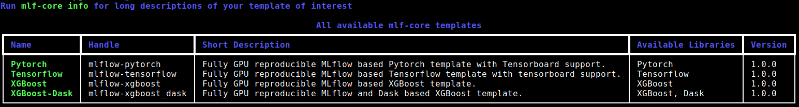
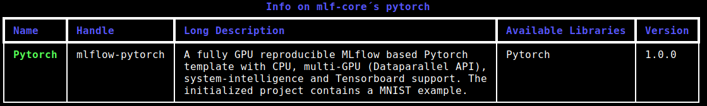

.. _list_info:

=============================================
Getting information about available templates
=============================================

Although, information on all mlf-core templates is provided in :ref:`available_templates` in our documentation, it is often times more convenient to get a quick overview from the commandline.
Hence, mlf-core provides two commands ``list`` and ``info``, which print information on all available templates with different levels of detail.

list
-----

``mlf-core list`` is restricted to the short descriptions of the templates. If you want to read more about a specific (sets of) template, please use the :ref:`info_f` command.

   Example output of :code:`mlf-core list`. Note that the content of the output is of course subject to change.

Usage
~~~~~~~

mlf-core list can be invoked *via*

.. code-block:: console

    $ mlf-core list

.. _info_f:

info
------

The ``info`` command should be used when the short description of a template is not sufficient and a more detailed description of a specific template is required.

   Example output of ``mlf-core info``.

Usage
~~~~~~~

Invoke :code:`mlf-core info` *via*

.. code-block:: console

    $ mlf-core info <HANDLE/FRAMEWORK/DOMAIN>

- ``HANDLE`` : a mlf-core template handle such as ``mlflow-pytorch``.

- ``DOMAIN`` : a domain for which mlf-core provides templates for. Example: ``mlflow``.

- ``FRAMEWORK`` : A framework or library for which mlf-core provides templates for. Example: ``pytorch``.

