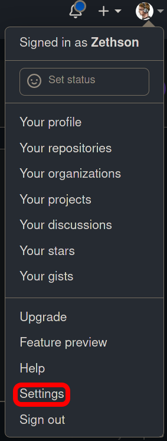
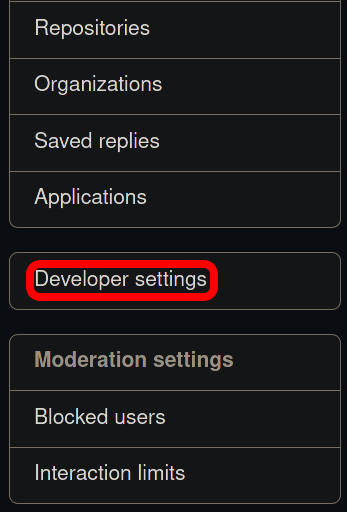
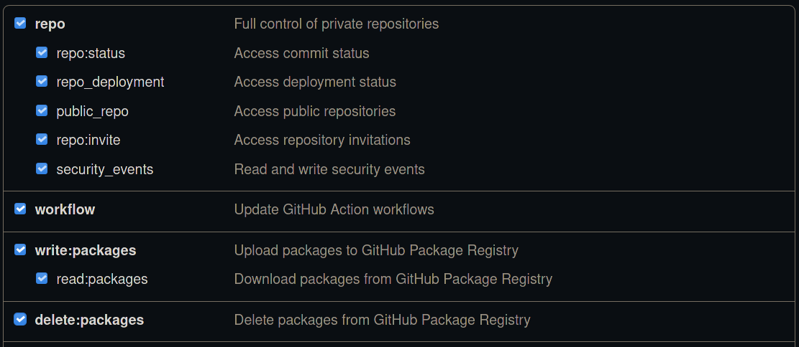

.. _tutorial:

==========
Tutorial
==========

Disclaimer
-----------

.. warning:: **This page is currently under development. Please check back later.**

.. warning:: This document serves as a single page tutorial for mlf-core, the issue of deterministic machine learning and everything related.
             It is **not** supposed to be used as a reference documentation for specific pieces of information.
             Please use the remaining mlf-core or the respective tools' documentation for this purpose.
             Although, mlf-core is designed with users in mind and as easy as possible it is inherently complex due to the nature of the issue it solves.
             Hence, please be patient while working through this tutorial.

Introduction
-------------

The fields of machine learning and artificial intelligence grew immensly in recent years.
Nevertheless, many papers cannot be reproduced and it is difficult for scientists even after rigorous peer review to know which results to trust.
This serious problem is known as the reproducibility crisis in machine learning.
The reasons for this issue are manifold, but include the fact that major machine learning libraries default to the usage of non-deterministic algorithms based on atomic operations.
Solely fixing all random seeds is not sufficient for deterministic machine learning.
Fortunately, major machine learning libraries such as Pytorch, Tensoflow and XGBoost are aware of these issues and the they are slowly providing
more and more deterministic variants of these atomic operations based algorithms.
We evaluated the current state of deterministic machine learning and formulated a set of requirements for fully reproducible machine learning even with several GPUs.
Based on this evaluation we developed the mlf-core ecosystem, an intuitive software solution solving the issue of irreproducible machine learning.

mlf-core Overview
-------------------

The mlf-core ecosystem consists of the primary Python packages `mlf-core <https://github.com/mlf-core/mlf-core>`_ and `system-intelligence <https://github.com/mlf-core/system-intelligence>`_,
a set of GPU enable `docker containers <https://github.com/mlf-core/containers>` and various fully reproducible machine learning projects found in the `mlf-core Github organization <https://github.com/mlf-core>`_.

.. figure:: images/mlf_core_overview.png
   :alt: mlf-core overview

   An overview of the mlf-core project.

This tutorial will primarily focus on the mlf-core Python package since it is the part that users will knowingly use the most.
Additionally, mlf-core makes heavy use of `Conda <https://docs.conda.io/en/latest/>`_, `Docker <https://www.docker.com/>`_, Github_ and `Github Actions <https://github.com/features/actions>`_.
We **strongly** suggest that you look for tutorials on Youtube or your favorite search engine to get comfortable with these technologies before proceeding further.
Whenever we use more advanced features of these tools we will explain them. Therefore you don't need to be an expert, but a good overview is helpful.

Installation
-------------

The mlf-core Python package is available on `PyPI <https://pypi.org/project/mlf-core/>`_ and the latest version can be installed with

.. code-block:: console

    $ pip install mlf-core

It is advised to use a virtual environment for mlf-core since it relies on explicitly pinning many requirements.
To verify that your installation was successful run:

.. code-block:: console

    $ mlf-core --help

Configuration
--------------

mlf-core tightly (optionally, but **strongly recommended**) integrates with Github and wants to prevent overhead when creating several projects.
Therefore mlf-core requires a little bit of configuration before the first usage.
To configure mlf-core run:

.. code-block:: console

    $ mlf-core config all

Enter your full name, your email and your Github username (hit enter if not available).
Next you will be asked whether you want to update your Github personal access token.
mlf-core requires your Github access token to automatically create a Github repository to upload your code and to enable mlf-core's sync functionality (explained later).
Hence, answer with **y**. Now you will be prompted for the token.
To create a token go to Github_ and log in. Next, click on your profile avater and navigate to 'Settings'.

   Click on 'Settings'.

Now navigate to the 'Developer settings'.

Click on 'Developer settings' in the bottom left. Then access 'Personal access token' and click 'Generate new token in the top right.
You should now be prompted for your password. Enter a name for the note that clearly specifies what it is for e.g. 'mlf-core token'.
Tick all options in the following image:

   Select **all** of the in the screenshot ticked options. No additional options are required, especially not repository deletion.

Click 'Generate token' at the very bottom and copy your token into the prompt of mlf-core. Hit enter and accept the update.
mlf-core is now configured and ready to be used!

For more details including security precautions please visit :ref:`config` and :ref:`github_support`.

.. _Github: https://github.com

Creating a mlf-core project
------------------------------

mlf-core project overview
----------------------------
